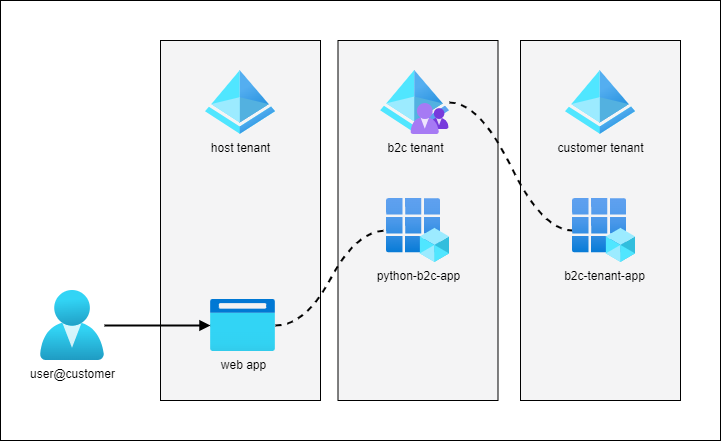

Overview
========

This project demonstrates how to integrate Azure Active Directory B2C in a Python web application. It is based on https://github.com/Azure-Samples/ms-identity-python-webapp.git

- Prerequisites
- Infrastructure Setup
- Configure Development Environment

Prerequisites
=============

- Tenant subscription to host the application (Host Tenant)
- B2C Tenant `Create an AD B2C Tenant <https://docs.microsoft.com/en-us/azure/active-directory-b2c/tutorial-create-tenant>`_
- Customer Tenanat

Infra Setup
===========

- Create Python Web Application
- Register a B2C application for the python web app.
- Configure B2C Identity providers
- Create User Flows for Authenticating B2C Users in the web app
- Create an App service to host the Web App
- Create GitHub OAuth application

Create App Service
-------------------

.. code-block:: bash

    # Optional Load .env vars
    # set -o allexport; source .env; set +o allexport

    az login --tenant $TENANT_NAME.onmicrosoft.com

    let "randomIdentifier=$RANDOM*$RANDOM"
    rg_region=eastus
    rg_name=LMS-WebApp-RG

    app_plan="asp-lms-$randomIdentifier"
    webapp_name="wa-lms-$randomIdentifier"

    # Create a resource group.
    az group create --name $rg_name --location "$rg_region"

    # Create an App Service plan in `FREE` tier.
    az appservice plan create --name $app_plan --resource-group $rg_name --sku FREE --location $rg_region --is-linux

    # Create a web app.
    az webapp create --name $webapp_name --resource-group $rg_name --plan $app_plan --runtime PYTHON:3.9
    az webapp auth update --resource-group $rg_name --name $webapp_name --enabled false

Register and Configure Application
----------------------------------

Register the application with the B2C tenant to provide authentication for B2C users.

Save the registered ``app_id`` and ``password`` for development or deploying to ``.env``.

.. code-block:: bash

    # load .env vars (optional)
    # set -o allexport; source .env; set +o allexport
    app_name=python-b2c-app

    # constants
    ms_graph_api_id="00000003-0000-0000-c000-000000000000"
    ms_graph_openid_permission="37f7f235-527c-4136-accd-4a02d197296e"
    ms_graph_offline_access_permission="7427e0e9-2fba-42fe-b0c0-848c9e6a8182"
    ms_graph_email_permission="64a6cdd6-aab1-4aaf-94b8-3cc8405e90d0"
    ms_graph_profile_permission="14dad69e-099b-42c9-810b-d002981feec1"
    app_secret_name=py_webapp_client_secret

    az login --tenant $B2C_TENANT.onmicrosoft.com --allow-no-subscriptions

    # create app
    app_id=$(az ad app create --display-name $app_name --query id -o tsv)
    # Save app_id to .env CLIENT_ID

    # configure authentication
    az ad app update --id $app_id --web-redirect-uris "https://jwt.ms http://127.0.0.1:5000/getAToken https://${webapp_name}.azurewebsites.net/getAToken"
    # manually set implicit grant and hybrid flow (Optional)
    # select both access tokens and id tokens when testing with https://jwt.ms/.
    # found on application authentication page

    # create client secret (application password)
    az ad app credential reset --id $app_id --display-name $app_secret_name --year 2
    # save password to .env CLIENT_SECRET

    # configure api permissions
    az ad app permission add --id $app_id --api $ms_graph_api_id --api-permissions $ms_graph_openid_permission=Scope $ms_graph_offline_access_permission=Scope
    az ad app permission admin-consent --id $app_id

To get available permissions for Microsoft Graph API run:

.. code-block:: bash

    # appRoles correspond to Role in --api-permissions
    az ad sp show --id $ms_graph_api_id | jq '.appRoles[] | {displayName,id}'

    # oauth2PermissionScopes correspond to Scope in --api-permissions
    az ad sp show --id $ms_graph_api_id | jq '.oauth2PermissionScopes[] | {adminConsentDisplayName,type,id}'

To auto-append .env file with CLIENT_ID and CLIENT_SECRET use:

.. code-block:: bash

    az ad app credential reset --id $app_id --display-name $app_secret_name --year 2 | jq -r '.password' | awk '{printf "APP_CLIENT_SECRET=%s", $1;}' >> .env

Configure B2C Identity providers
--------------------------------

Configuring an identify provider is a two step process:

1. Create an application with the provider
2. Register the provider in the ``$B2C_TENANT``

Create Application for Customer Provider (Azure AD)
~~~~~~~~~~~~~~~~~~~~~~~~~~~~~~~~~~~~~~~~~~~~~~~~~~~

.. code-block:: bash

    app_name="${B2C_TENANT} OpenID Connect"
    app_secret_name="${B2C_TENANT} odic"

    az login --tenant $CUSTOMER_TENANT.onmicrosoft.com
    # create app
    app_id=$(az ad app create --display-name $app_name --query id -o tsv)
    # Save app_id to .env CUSTOMER_APP_CLIENT_ID

    # configure authentication
    az ad app update --id $app_id --web-redirect-uris "https://${B2C_TENANT}.b2clogin.com/${B2C_TENANT}.onmicrosoft.com/oauth2/authresp"

    # manually set implicit grant and hybrid flow
    # select id tokens
    # found on application authentication page

    # create client secret (application password)
    az ad app credential reset --id $app_id --display-name $app_secret_name --year 2
    # save password to .env CUSTOMER_APP_CLIENT_SECRET

    # configure api permissions
    az ad app permission add --id $app_id --api $ms_graph_api_id --api-permissions $ms_graph_openid_permission=Scope $ms_graph_offline_access_permission=Scope $ms_graph_email_permission=Scope $ms_graph_profile_permission=Scope
    az ad app permission admin-consent --id $app_id

    # Save app_id and password to .env

Register Customer Identity Provider
~~~~~~~~~~~~~~~~~~~~~~~~~~~~~~~~~~~

.. code-block:: bash

    az login --tenant $B2C_TENANT.onmicrosoft.com --allow-no-subscriptions
    az rest --method GET --uri "https://graph.microsoft.com/v1.0/identity/identityProviders"

    az rest --method POST -url "https://graph.microsoft.com/beta/identityProviders" --body \
        "
        {
            "@odata.type": "microsoft.graph.openIdConnectProvider",
            "name": "Login with ${CUSTOMER_TENANT} identity provider",
            "type": "OpenIDConnect",
            "metadataUrl": "https://login.microsoftonline.com/${CUSTOMER_TENANT_ID}/v2.0/.well-known/openid-configuration",
            "clientId": "${CUSTOMER_APP_CLIENT_ID}",
            "clientSecret": "${CUSTOMER_APP_CLIENT_SECRET}",
            "scope": "openid email profile",
            "responseType": "id_token",
            "responseMode": "form_post",
            "domainHint": "${CUSTOMER_TENANT_DOMAIN}",
            "claimsMapping": {
                "userId": "oid",
                "displayName": "name",
                "givenName": "given_name",
                "surname": "family_name",
                "email": "preferred_username"
            }
        }"

Create Application for GitHub Provider
~~~~~~~~~~~~~~~~~~~~~~~~~~~~~~~~~~~~~~

- Navigate to https://github.com/settings/developers
- Select New OAuth App
- Enter App name ``"${B2C_TENANT} OpenID Connect"`` and callbackurl as ``"https://${B2C_TENANT}.b2clogin.com/${B2C_TENANT}.onmicrosoft.com/oauth2/authresp"``
- Register and save `Client ID` and `Client Secret` to `.env` file.

Configure GitHub as an Identity identity-provider-github
~~~~~~~~~~~~~~~~~~~~~~~~~~~~~~~~~~~~~~~~~~~~~~~~~~~~~~~~

.. code-block:: bash

    az login --tenant $B2C_TENANT.onmicrosoft.com --allow-no-subscriptions
    az rest --method GET --uri "https://graph.microsoft.com/v1.0/identity/identityProviders"

    az rest --method POST -url "https://graph.microsoft.com/v1.0/identity/identityProviders" --body \
        "
        {
            "@odata.type": "microsoft.graph.socialIdentityProvider",
            "displayName": "Login with GitHub",
            "identityProviderType": "GitHub",
            "clientId": "$GH_APP_CLIENT_ID",
            "clientSecret": "$GH_APP_CLIENT_SECRET"
        }"

Create user Flows
-----------------

- A combined Sign in and sign up user flow, such as susi. This user flow also supports the Forgot your password experience.
- A Profile editing user flow, such as edit_profile.
- Add Customer and GitHub Identity provider to a user flow

Configure dev environment
=========================

Setup your dev environment by creating a virtual environment

.. code-block:: bash

    # Windows
    # virtualenv \path\to\.venv -p path\to\specific_version_python.exe
    # C:\Users\!Admin\AppData\Local\Programs\Python\Python310\python.exe -m venv .venv
    # .venv\scripts\activate

    # Linux
    # virtualenv .venv /usr/local/bin/python3.10
    # python3.10 -m venv .venv
    # python3 -m venv .venv
    python3 -m venv .venv
    source .venv/bin/activate

    # Update pip
    python -m pip install --upgrade pip

    deactivate

Install dependencies and configure ``local.env``.

.. code-block:: bash

    # Install dependencies
    pip install -r requirements_dev.txt

    # Replace settings in local.env
    cp example.env .env

    # Optional - Load .env into bash ENV vars
    # set -o allexport; source .env; set +o allexport

Install locally for development and enable pre-commit scripts.

.. code-block:: bash

    pip install --editable .

    pre-commit install

Style Guidelines
----------------

This project enforces quite strict `PEP8 <https://www.python.org/dev/peps/pep-0008/>`_ and `PEP257 (Docstring Conventions) <https://www.python.org/dev/peps/pep-0257/>`_ compliance on all code submitted.

We use `Black <https://github.com/psf/black>`_ for uncompromised code formatting.

Summary of the most relevant points:

- Comments should be full sentences and end with a period.
- `Imports <https://www.python.org/dev/peps/pep-0008/#imports>`_  should be ordered.
- Constants and the content of lists and dictionaries should be in alphabetical order.
- It is advisable to adjust IDE or editor settings to match those requirements.

Use new style string formatting
-------------------------------

Prefer `f-strings <https://docs.python.org/3/reference/lexical_analysis.html#f-strings>`_ over ``%`` or ``str.format``.

.. code-block:: python

    # New
    f"{some_value} {some_other_value}"
    # Old, wrong
    "{} {}".format("New", "style")
    "%s %s" % ("Old", "style")

One exception is for logging which uses the percentage formatting. This is to avoid formatting the log message when it is suppressed.

.. code-block:: python

    _LOGGER.info("Can't connect to the webservice %s at %s", string1, string2)

Testing
--------
You'll need to install the test dependencies and project into your Python environment:

.. code-block:: bash

    pip3 install -r requirements_dev.txt
    pip install --editable .

Now that you have all test dependencies installed, you can run tests on the project:

.. code-block:: bash

    isort .
    codespell  --skip="./.*,*.csv,*.json,*.pyc,./docs/_build/*,./htmlcov/*,*.egg-info"
    black *.py
    flake8 .
    pylint *.py
    rstcheck **/*.rst
    pydocstyle *.py
    shellcheck scripts/*

Deploy Web App
--------------

Deploy web app to app service.

.. code-block:: bash

    az login --tenant $TENANT.onmicrosoft.com

    gitrepo=https://github.com/briglx/python-b2c-app

    # Deploy code from a public GitHub repository.
    az webapp deployment source config --name $webapp_name --resource-group $rg_name --repo-url $gitrepo --branch master --manual-integration

    # Set app env vars
    az webapp config appsettings set --name $webapp_name --resource-group $rg_name --settings @prod.env

     # enable logs
    az webapp log config --web-server-logging filesystem --name $webapp_name --resource-group $rg_name

    # tail logs
    az webapp log tail --name $webapp_name --resource-group $rg_name

    # Update application web-redirect-url
    az login --tenant $B2C_TENANT.onmicrosoft.com --allow-no-subscriptions
    app_id=$(az ad app list --display-name $app_name --query [].appId -o tsv)
    az ad app update --id $app_id --web-redirect-uris https://$webapp_name.azurewebsites.net/getAToken

    # Create Sample Data
    onboard_group_name=onboarding_admins
    scripts/create_sample_data.sh

    sample_customer_group_name=constoso_com
    az ad group create --display-name $onboard_group_name --mail-nickname $onboard_group_name
    az ad user create --display-name myuser --password password --user-principal-name myuser@contoso.com
    az ad group create --display-name $sample_customer_group_name --mail-nickname $sample_customer_group_name

References
==========

- B2C Auth in Python app https://docs.microsoft.com/en-us/azure/active-directory-b2c/configure-authentication-sample-python-web-app?tabs=windows
- Register an app in AAD B2C https://docs.microsoft.com/en-us/azure/active-directory-b2c/tutorial-register-applications?tabs=app-reg-ga
- Example Sign in Flow https://docs.microsoft.com/en-us/azure/active-directory-b2c/add-sign-up-and-sign-in-policy?pivots=b2c-user-flow
- Azure Graph API create an app https://docs.microsoft.com/en-us/graph/api/application-post-applications?view=graph-rest-1.0&tabs=http
- Google shell style https://google.github.io/styleguide/shellguide.html
- Azure Graph REST API User https://docs.microsoft.com/en-us/graph/api/resources/user?view=graph-rest-1.0
- Create GitHub OAuth app https://docs.microsoft.com/en-us/azure/active-directory-b2c/identity-provider-github
- OpenID Connect with AAD https://docs.microsoft.com/en-us/azure/active-directory/fundamentals/auth-oidc
- OpenID Connect https://docs.microsoft.com/en-us/azure/active-directory/develop/v2-protocols-oidc#send-the-sign-in-request
- OAuth Code Flow https://auth0.com/docs/get-started/authentication-and-authorization-flow/authorization-code-flow
